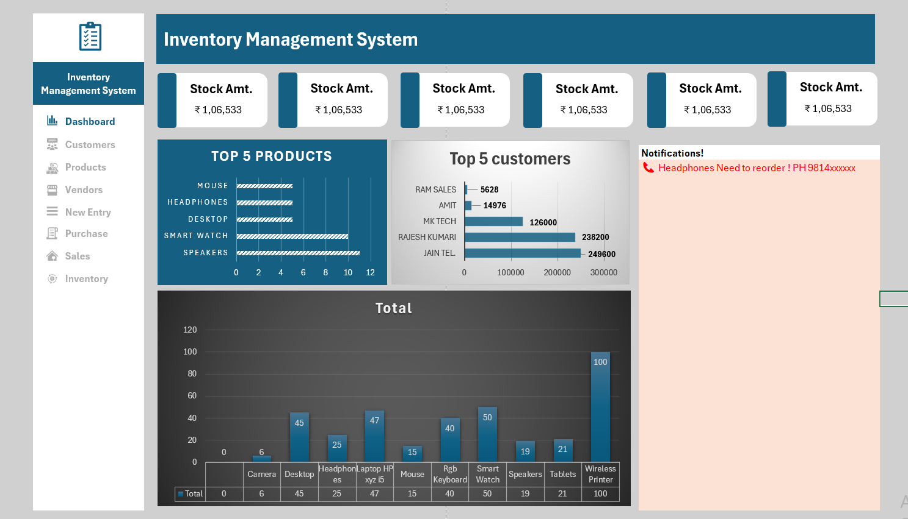

# Automated Inventory Management System in Excel

A fully automated inventory management system developed in **Microsoft Excel**, designed to help users manage their **stock, purchases, sales, customers, vendors**, and generate a real-time dashboard with zero manual calculations.

This project is ideal for small businesses, individual shop owners, or Excel enthusiasts looking for a robust stock management tool built entirely with formulas—no macros, no code.

---

## Key Highlights

-  Interactive & dynamic dashboard
-  Real-time stock updates
-  Purchase & sales tracking with automated calculations
-  Product, customer & vendor master data integration
-  Clean UI with automated data validation and formulas

---

##  Included Sheets

| Sheet Name         | Functionality                                         |
|--------------------|-------------------------------------------------------|
| `Dashboard`         | Visual summary of key metrics — stock, sales, etc.    |
| `Product Master`    | List of all products with item codes                  |
| `Customer Master`   | Customer database                                     |
| `Vendor Master`     | Vendor database                                       |
| `Purchase`          | Purchase records — quantity, rate, vendor, etc.       |
| `Sales`             | Sales records — quantity, rate, customer, etc.        |
| `Stock Summary`     | Auto-calculated available stock per product           |

---

## Core Functionalities

- **Dynamic Dropdowns** for selecting products, customers, vendors
- **Auto Stock Calculation** using `SUMIFS`, `IFERROR`, and lookup functions
- **Dashboard Charts** for visual insight into stock status and transactions
- **No VBA/Macros** — fully formula-driven system

---

## 🖼 Sample Screenshot

You can add a screenshot to showcase the dashboard:
```markdown

